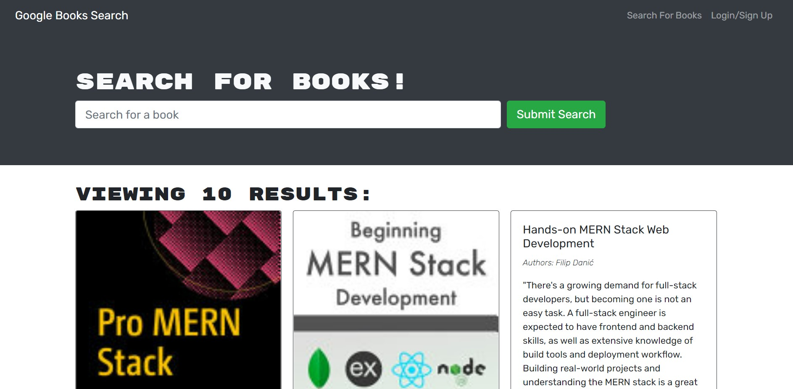

# mernSearchEngine

## Homework 21 - MERN Book Search Engine

This application allows users to search for new books to read, so that they can keep a list of books to purchase.

## Mock-up

## Installation

This application requires installation of npm (incl. apollo-client, concurrently, and graphql) and Heroku. For a complete list of node modules to install, please examine the package.json files at the link below.

All elements of the application can be examined here: https://github.com/matthewestes33/mernSearchEngine

The deployed application can be used here: https://gentle-everglades-11160.herokuapp.com/

## Credits

Documentation:

Get Started with Apollo Client: https://www.apollographql.com/docs/react/get-started/ 

Getting Started with Atlas: https://www.mongodb.com/docs/atlas/getting-started/

Additional assistance:

Thank you to my instructional staff Farish and Riley, tutor Juan Delgado, and AskBCS Learning Assistants!

## Features

When users load the search engine, they are presented with a menu with the options "Search for Books" and "Login/Signup".

When users click on the "Search for Books" menu option, they are presented with an input field to search for books with a "Submit" button.

When users are not logged in and enter a search term in the input field and click the Submit button, they are presented with search results, each featuring a book’s title, author, description, image, and a link to that book on the Google Books site.

When users click on the Login/Signup menu option, a modal appears on the screen with a toggle between the option to log in or sign up.

When the toggle is set to Signup, users are presented with three inputs for username, email address, and password, as well as a Signup button.

When the toggle is set to Login, users are presented with two inputs for email address and password, as well as a Login button.

When users enter a valid email address, create a password, and click on the Signup button, a user account is created for them, and they are logged into the site.

When users enter an account’s correct email address and password and click on the Login button, the modal closes and they are logged into the site.

When users are logged into the site, the menu options change to "Search for Books", an option to see saved books, and "Logout".

When users are logged in, enter a search term in the input field, and click the Submit button, they are presented with search results, each featuring a book’s title, author, description, image, a link to that book on the Google Books site, and a button to save a book to their individual account.

When users click on the Save button on a book, that book’s information is saved to their individual account.

When users click on the option to see their saved books, they are presented with all of the books they have previously saved, each featuring the book’s title, author, description, image, a link to that book on the Google Books site, and a button to remove a book from their individual account.

When users click on the Remove button on a book, that book is deleted from their individual account's saved books list.

When users click on the Logout button, they are logged out of the site and  presented with a menu with the options "Search for Books" and "Login/Signup", as well as an input field to search for books with a "Submit" button.
